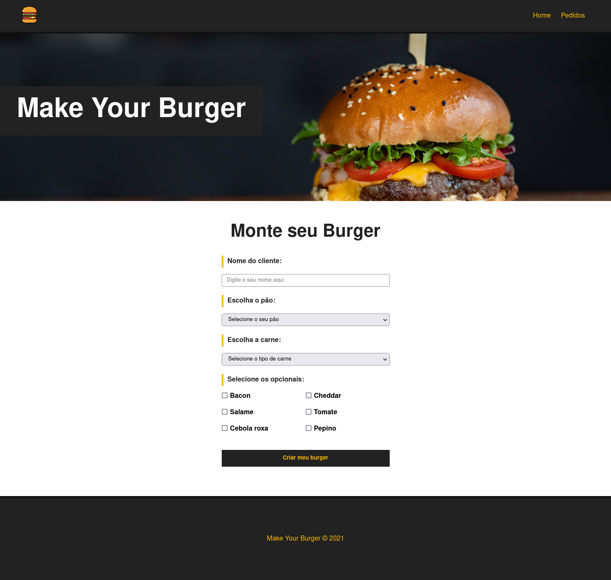
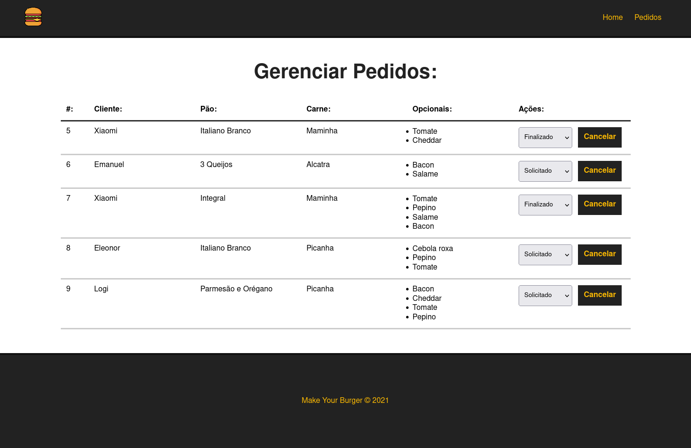

# Projeto de aprendizagm VueJS 3

## Make your Burger

Intalar globalmente o json-server:

```
npm install -g json-server
```

Execute o script `db.json` na pasta `/db/db.json`

```
json-server db/db.json
```

Para executar o projeto basta digitar o seguinte comando no terminal:

```
npm run server
```

### Segue as screenshot



